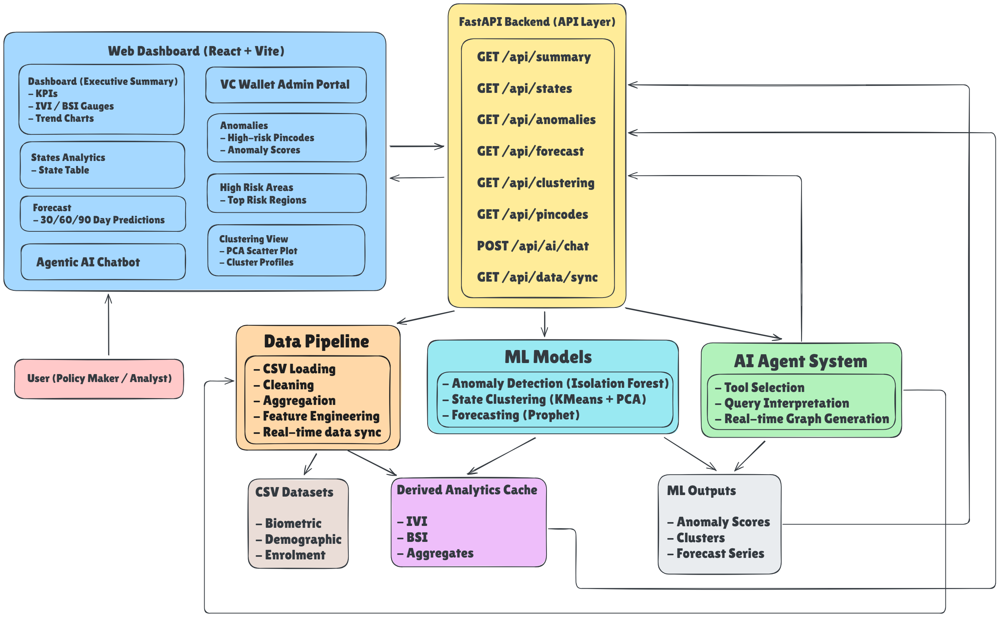
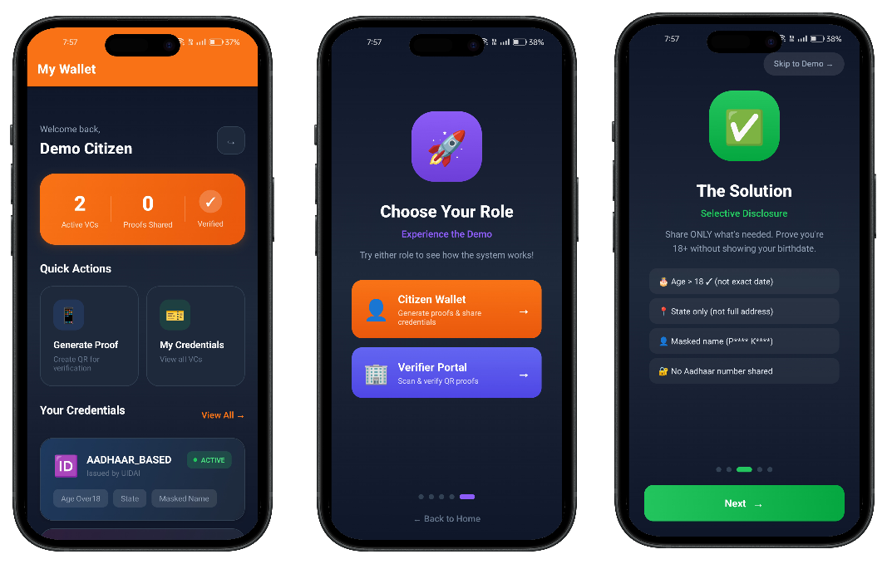
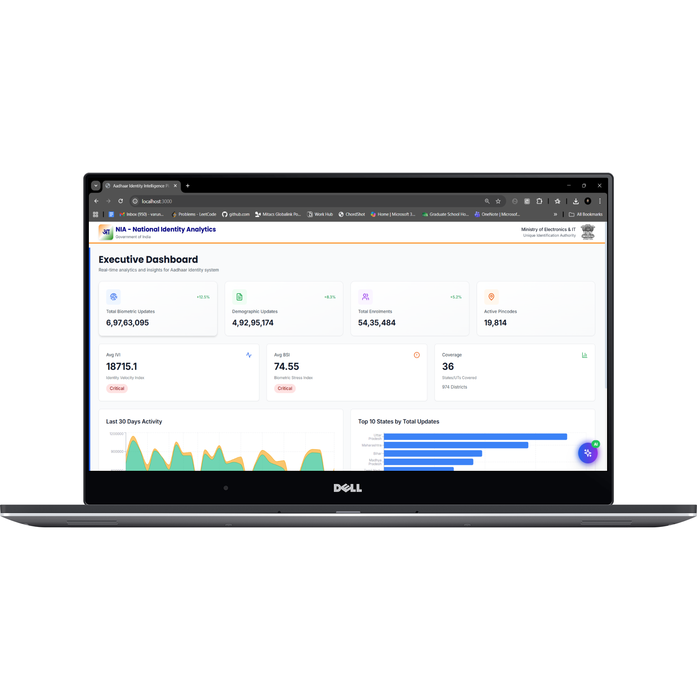

# NIA – National Identity Analytics

<p align="center">
  <strong>Transforming India's Digital Identity Ecosystem</strong><br/>
  AI-powered Administrative Intelligence + Privacy-Preserving Citizen Verification
</p>

<p align="center">
  
</p>

<p align="center">
  <a href="https://python.org">
    
  </a>
  <a href="https://reactjs.org">
    
  </a>
  <a href="https://fastapi.tiangolo.com">
    
  </a>
  <a href="https://build.nvidia.com">
    
  </a>
</p>

<p align="center">
  <a href="https://drive.google.com/file/d/1cLIenbPpZ1w6wnslqrjDBvIyBuAuqMRf/view?usp=sharing">VC Wallet Demo</a> •
  <a href="https://drive.google.com/file/d/15UgQSCB2vIiHkLK2vv_JRwo-nv1_AoTg/view?usp=drive_link">Analytics Web Dashboard Demo</a>
</p>

---

## Table of Contents

- [Overview](#overview)
- [Problem Statement](#problem-statement)
- [Key Innovation](#key-innovation)
- [Features](#features)
- [Architecture](#architecture)
- [Technology Stack](#technology-stack)
- [Getting Started](#getting-started)
- [Usage](#usage)
- [Novel Contributions](#novel-contributions)
- [Performance](#performance)
- [Screenshots](#screenshots)
- [Team](#team)
- [License](#license)

---

## Overview

**NIA – National Identity Analytics** is an enterprise-grade analytics engine designed to help administrators, policymakers, and fraud investigators understand the pulse of India's large-scale digital identity ecosystem.

By combining high-performance data processing with cutting-edge AI, NIA transforms raw enrolment and update logs into:

- Real-time dashboards  
- Predictive intelligence  
- Privacy-preserving verification systems  

---

## Problem Statement

Managing the identity lifecycle of over a billion citizens is an immense challenge.

Traditional reporting tools look backward — showing what happened last month.  
**NIA looks forward.**

It answers critical questions in real time:

- Where is the next surge in biometric updates coming from?
- Which pincodes show suspicious update patterns?
- How should staffing be optimized for next week?

---

## Key Innovation

NIA introduces **AI-powered conversational analytics** combined with **proprietary risk indices**:

- **Identity Velocity Index (IVI)**
- **Biometric Stress Index (BSI)**

Unlike traditional BI tools, NIA enables **natural language querying** of complex administrative data while preserving privacy at scale.

---

## Features

### AI Analyst Assistant

Stop writing queries. **Start asking questions.**

Ask questions in plain English and get instant insights:

> *“Which state has the highest biometric stress index this month?”*

---

### Real-Time Anomaly Detection

Spot fraud before it spreads.

- Detects suspicious spikes
- Flags high-risk pincodes
- Identifies demographic and biometric anomalies

---

### Predictive Forecasting

Know what’s coming.

- 30-day enrolment predictions
- Capacity and staffing optimization
- Proactive infrastructure planning

---

### Granular Regional Intelligence

Drill down seamlessly:

**National → State → District → Pincode**

Compare regions using IVI and BSI for instant operational insight.

---

### Dynamic Clustering

Group states by behavior, not geography.

Machine learning clusters regions with similar stress patterns to enable targeted interventions.

---

## Architecture

<p align="center">
  
</p>

<p align="center">
  
</p>

### Key Components

- **Data Pipeline:** Polars (10× faster than Pandas)
- **ML Engine:** Forecasting, clustering, anomaly detection
- **AI Agent:** NVIDIA NIM conversational analytics
- **Cache Layer:** Redis
- **Frontend:** React dashboards

---

## Technology Stack

### Backend
- FastAPI
- Polars
- NVIDIA NIM
- Redis
- SQLite
- Scikit-learn

### Frontend
- React 18
- Vite
- TailwindCSS
- Chart.js
- Axios

### Data & ML
- Prophet
- NumPy
- Pandas (legacy)

### Agentic AI
- LangGraph

---

## Getting Started

### Prerequisites
- Python 3.10+
- Node.js 18+

### Launch

**Windows**
```cmd
start_platform.bat
````

**Linux / macOS**

```bash
./start_platform.sh
```

Access:

* Dashboard: [http://localhost:5173](http://localhost:5173)
* API Docs: [http://localhost:8000/docs](http://localhost:8000/docs)

---

## Usage

### Use Cases

* **Policy Makers:** Data-driven interventions
* **Fraud Teams:** High-risk pincode detection
* **Operations:** Staffing optimization
* **Analysts:** Clean exports without manual preprocessing

### AI Assistant Examples

* “Show anomalous pincodes in Maharashtra”
* “Predict enrolment volume for Karnataka next 30 days”
* “Which state has highest BSI this month?”

---

## Novel Contributions

1. **Proprietary Risk Indices (IVI & BSI)**
2. **Conversational Analytics (No SQL / BI required)**
3. **Privacy-Preserving Aggregation**
4. **Real-Time Pincode-Level Anomaly Detection**
5. **Predictive Capacity Planning**

---

## Performance

* 2M+ records processed in < 5 seconds
* Sub-second cached queries
* 1000+ concurrent users
* AI responses in ~2–3 seconds

---

## Screenshots

<p align="center">
  
</p>

### Web Dashboard

|                        |                        |
| ---------------------- | ---------------------- |
|  |  |
|  |  |

---

## Team

* [Vaidik Jaiswal](https://github.com/vaidikjais)
* [Arslaan Siddiqui](https://github.com/arslaan5)

---

*Built for the future of Identity Management.*